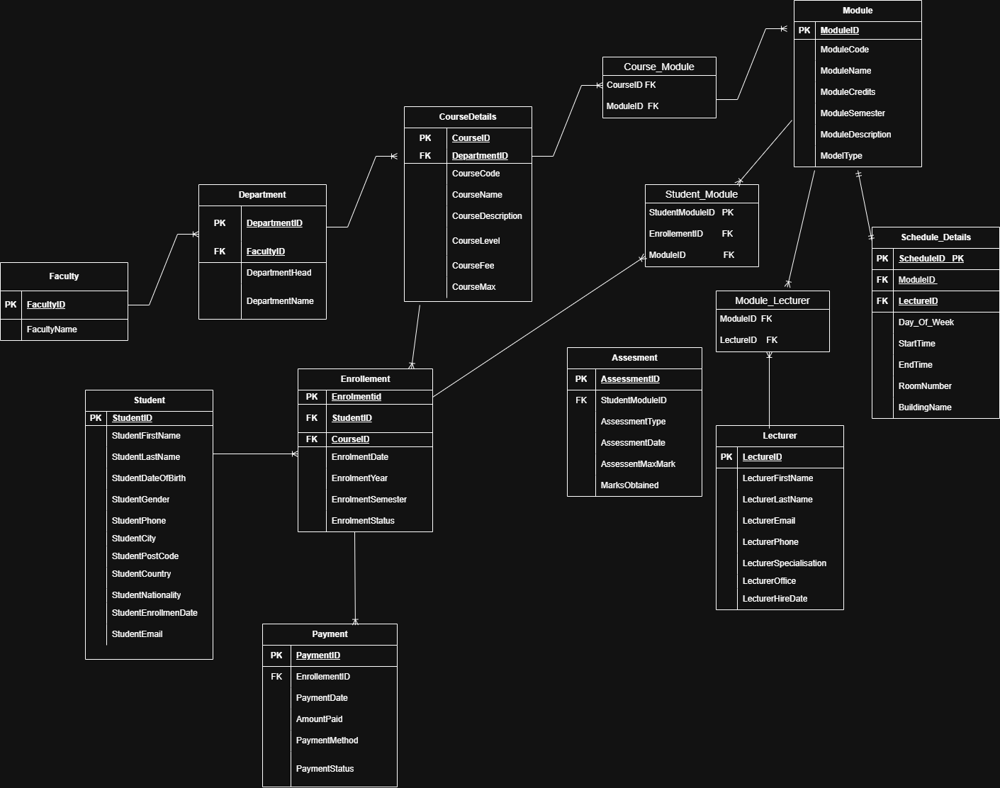

# student-managing-system

## Project Overview
This project is a relational dataabaase system for managing a univerisity's courses,modules, students,lecturers, enrollements, assessments, and payments. It provides an integrated solution to the probmen of montoring the progress of a student through his/her degree program starting from enrollment in a particular course to allocation of modules and lectures, to recording assesment marks and payments-all in one connected system insead of scattered spreadsheets
## Database Schema

The schema was normalised from 1NF to 3NF through several iterations, resulting in 13 tables including three associative (junction) tables - ' Course_Moduke', 'Module_Lecturer', and 'Student_Module'- to resolve many to many relationships in the design.
## Technologies used
-Oracle SQL
-Oracle Apex

## Key Design Decisions
Course-to-Module and Module-toLecturer relationships are many to many, so without duplicating data acorss rows, it was solved by creating seperate associative tables each holding just the foreign keys- a standard normalisation technique to avoid repeating group data. 

Several Fields use CHECK constraints ro restrict values to a fixed set o valid options (eg: CourseLevel only accepts 'UG' or 'PG', PaymentStatus only accepts 'Paid
 or 'Partial'), so invalid data is rejected by the database itself rather than relying on the application layer to find mistakes.
